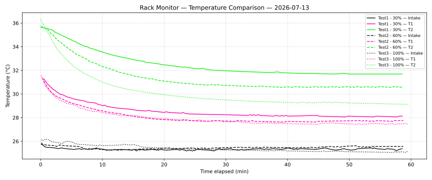

# Cooling Analysis Report 2026-07-13

The following report is showing the testresults of a cooling analysis test.

## Testcase

The rack-monitor and its fans and cooling capabilities are tested in three fan settings: 30%, 60% and 100%. The fans are mounted on the back and on the right side of the rack. The temperature sensors are located (T1) behind the mac mini underneath the internal fan outlet (T2) on top of the mac mini between both SSDs. The Intake temperature is taken directly in front of the side fan. Both fans are pulling air into the rack, not out. Every test was taken for exactly 1h.

## Testresults

The testresults are shown in the plot below:

    

The Intake temperature was nearly the same, with 25.4°C, in each test run. It is very good visible, that for Temperature Sensor 2, the effect of higher fan speed is very relevant on the cooling efficiency. With 100% fan speed, we can cool down around 7°C. Temperature Sensor 1 is not that efficient, and the effect of higher fan speed is not that high. There we can cool down aroung 4°C.

One thing to mention is, that for both sensors and for each fan speed, there seems to be a min. temperature.

| sensor | speed | min. temperature |
| ------ | ----- | ---------------- |
| 1 | 30% | 28.1 °C |
| 1 | 60% | 27.7 °C |
| 1 | 100% | 27.4 °C |
| 2 | 30% | 31.7 °C |
| 2 | 60% | 30.5 °C |
| 2 | 100% | 29.1 °C |

## Next Steps

The current automated fan curve is always giving 100% fan speed, as the temperature in the rack is pretty high compared to the environmental temperature. To mitigate this, we will adapt the fan control delta_T variable.

What else needs to be done is the position and orientation of the fans. The Mac Mini has the fan inlet at the bottom of the device and outlet on the back. Ideal would be to have a fan on the buttom, pulling air into the Mac and one on the back pulling the air outside of the rack. This setup should be evaluated.
