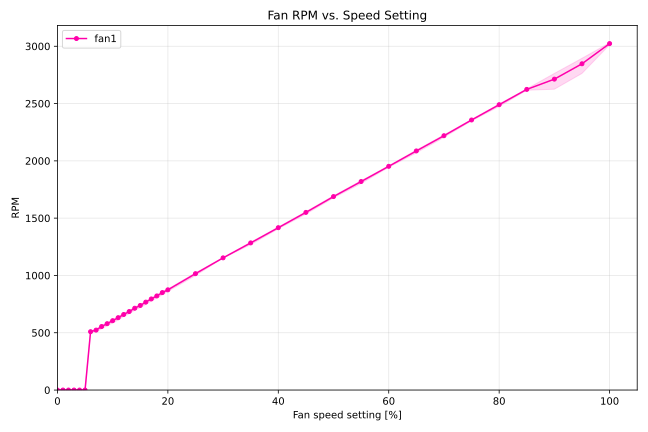

# Testreport - Arctic P12 Pro 12V PWM Fan

The [Arctic P12 Pro](https://www.arctic.de/en/P12-Pro/ACFAN00305A) fan has the following specifications:

| Specification | Value |
| ------------- | ----- |
| weight | 183 g |
| fan-speed |  600–3000 rpm, PWM controlled; 0 rpm below 5 % PWM |
| air-flow | 77 cfm; 131 m³/h |
| static-pressure |  6.9 mm H^2O |
| Typical Voltage | 12 V DC |
| Start Up Voltage | 3.3 V DC |
| Current | 0.33 A |

## Testcase

The Arctic P12 Pro Fans should be checked on their PWM to Fan Speed relationship. Therefore we are performing an automated testcase sweeping from 0 to 100% PWM and read out the fan speed in RPM. The test is performed in two test zones: 

1. between 0 % and 20 % with 1 % steps 
2. between 25 % and 100 % with 5 % steps

This difference is because we want to find out the minimum applicable fan speed setting.

## Testresults

The testresults can be seen in the following plot:

    

There are mainly three major findings:

1. The maximum Fan Speed at 100% is: **3030 rpm**
2. The minimum Speed, where the fan is actually on is: **6 % with ~500 rpm** (The specification here is wrong, it is 0 rpm below or equal 5 % PWM)
3. The Speed is following a linear function: **rpm = 27 * pwm + 332**
