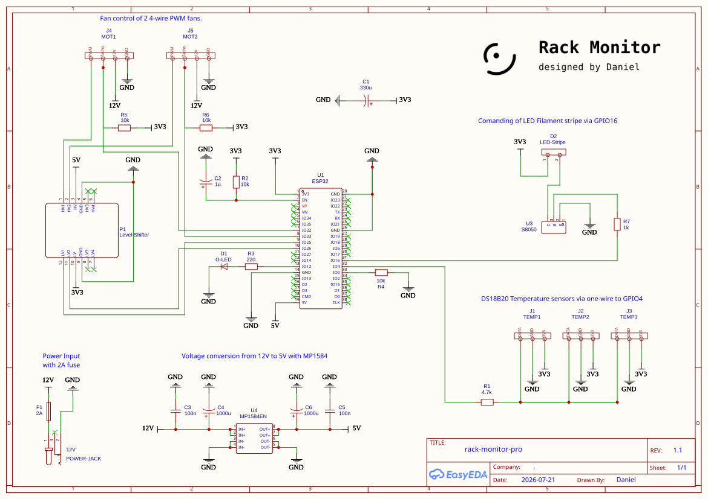
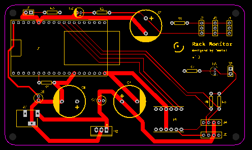
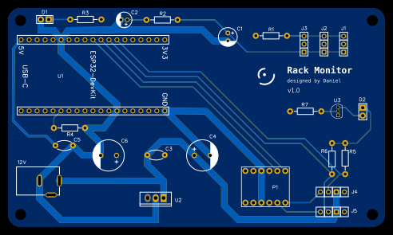

# PCB

A PCB is a printed circuit board that mechanically supports and electrically connects electronic parts using tiny copper tracks. It acts as the core base for electronics like phones, computers, and toys.

## Schematic

The schematic drawing shows all connections and parts. It serves as a baseline for the later PCB-design. The complete design is done with [easyEDA](https://easyeda.com/). The sources are stored in the respective `json`-files. There are several nets introduced in the schematic: 3V3, 5V, 12V and GND.

    

## PCB-Design

By designing the PCB, you place all components on the board and perform the wiring. The board has a size of `120x70mm`. For each part, you first need to define the related footprint, which is in some cases very specific, measure your existing HW-components carefully!

    

Track sizes are defined by current. In the existing setup we have: (1) ESP32 with 250mA (and up to 500mA during Startup) (2) LED's with ~ 150mA (3) temperature sensors with max. 5mA in total (4) the two PWM fans with up to 600 mA and even higher during startup. In total we expect 1.2 - 2 A. To allow these ammount of current, the track sizes are set as follows:

| net | width |
| --- | ----- |
| GND | 2mm |
| 12V | 2mm |
| 5V | 0.8mm |
| 3V3, Data, etc. | 0.3mm |

## final PCB

In the following picture you can see the final PCB (remark: only the top layer is shown). The respecitve gerber-file (zip archive) contains all the related data for production.

    

