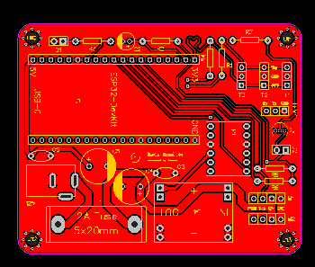
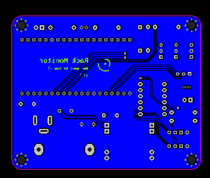
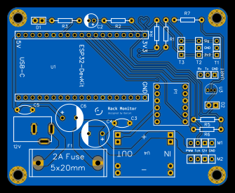
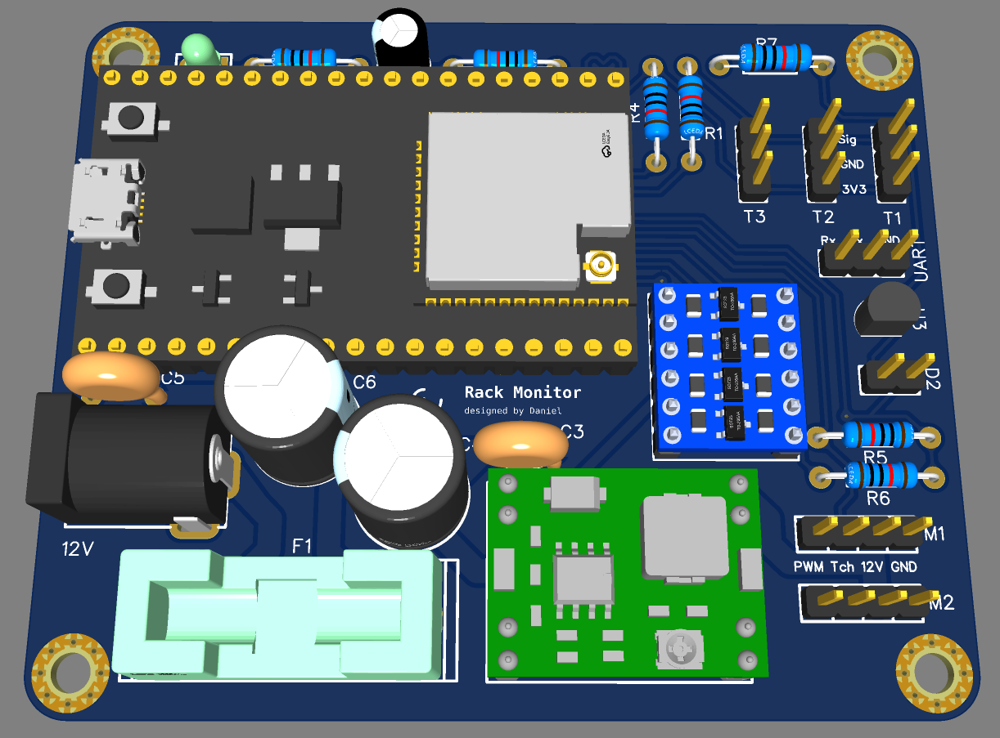

# PCB

A PCB is a printed circuit board that mechanically supports and electrically connects electronic parts using tiny copper tracks. It acts as the core base for electronics like phones, computers, and toys.

## Schematic

The schematic drawing shows all connections and parts. It serves as a baseline for the later PCB-design. The complete design is done with [easyEDA](https://easyeda.com/). The sources are stored in the respective `json`-files. There are several nets introduced in the schematic: 3V3, 5V, 12V and GND.

    

## PCB-Design

By designing the PCB, you place all components on the board and perform the wiring. The board has a size of `80x65mm`. For each part, you first need to define the related footprint, which is in some cases very specific, measure your existing HW-components carefully! In the following pictures you can see (1) top / front side and (2) bottom / back side of the PCB-board.

    
    

Track sizes are defined by current. In the existing setup we have: (1) ESP32 with 250mA (and up to 500mA during Startup) (2) LED's with ~ 150mA (3) temperature sensors with max. 5mA in total (4) the two PWM fans with up to 600 mA and even higher during startup. In total we expect 1.2 - 2 A. To allow these ammount of current, the track sizes are set as follows:

| net | width | clearance |
| --- | ----- | --------- |
| GND | 2mm | 0.4mm |
| 12V | 2mm | 0.2mm |
| 5V | 0.8mm | 0.2mm |
| 3V3, Data, etc. | 0.3mm | 0.2mm |

The GND is realized as GND-Planes on top and vorrom side instead of tracks. This allows good flow and reduces noise. In the following picture you can see the final PCB (remark: only the top layer is shown).

    

And the 3D-Model with components:

    

## Production

A **Gerber** file is a standard file format used to tell a PCB manufacturer how to make a printed circuit board (PCB). It contains layout data for each PCB layer, such as: copper traces, solder masks, markings, board outline, holes, etc...

A typical PCB oder includes multiple Gerber files (one per layer) plus drill files for holes. The manufacturer uses them to fabricate and assemble the board. For this project you can find all related gerber-files in `docs/pcb/gerber/`. The zipped version is attached to the latest release: [ha-rack-monitor/releases/latest](https://github.com/dan1elw/ha-rack-monitor/releases/latest).

The design is done with EasyEDA. The [gerber-files](https://docs.easyeda.com/en/PCB/Gerber-Generate/) are generated inside this tool. They contain the following files:

| file | description | used for production |
| ---- | ----------- | ------------------- |
| Drill_NPTH_Through.DRL | contains drill hole positions that does not need metallization on the inner wall, such as through holes | yes |
| Drill_PTH_Trough_Via.DRL | contains drill hole positions that needs metallization on the inner wall, for JLCPCB use only | yes |
| Drill_PTH_Through.DRL | contains drill hole positions that needs metallization on the inner wall, such as multi-layer pads | yes |
| Gerber_BoardOutlineLayer.GKO | contains the board shape for cutting the PCB board | yes |
| Gerber_BottomLayer.GBL | bottom copper foil layer | yes |
| Gerber_BottomSilkscreenLayer.GTO | bottom silkscreen layer | yes |
| Gerber_BottomSolderMaskLayer.GBS | the board is covered with oil by default, the elements drawn in this layer correspond to the areas on bottom layer without oil | yes |
| Gerber_DocumentLayer.GDL | record PCB remarks | no |
| Gerber_TopLayer.GTL | top copper foil layer | yes |
| Gerber_TopSilkscreenLayer.GTO | top silkscreen layer | yes |
| Gerber_TopSolderMaskLayer.GTS | the board is covered with oil by default, the elements drawn in this layer correspond to the areas on top layer without oil | yes |
