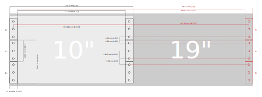
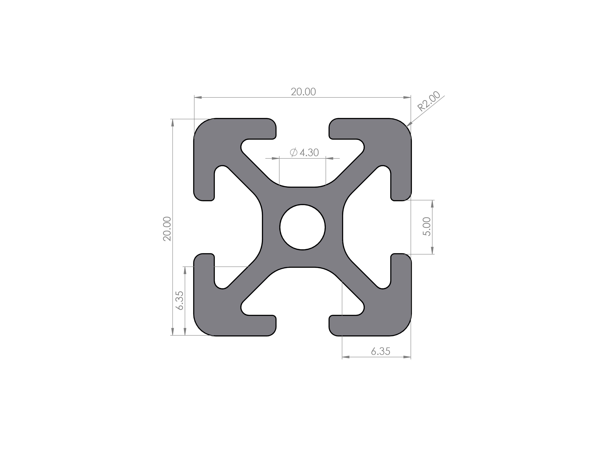

# Server-Rack with Aluminium-Profiles

## Decisions taken during design process

As I want to build a home-lab style server-rack, which can fit onto my desk, and also supports a lot of stock equipment, it will be realized as a `10 inch` server-rack. This results in the following dimensions:

I decided to build the rack itself with Aluminium Profiles with the size of `20 x 20 mm`. 

 Furthermore I want this rack to fit inside an Ikea Kallax shelf. This has inside dimensions of `33.5 x 33.5 cm`. By taking into account some space for an anti-scratch tape, the max. height of the server rack is limited to `33 cm`.

## Design of the rack

The rack is designed in FreeCAD. The files can be found here: `../hardware/cad-rack/`. The final rack has the outer dimensions (H, B, T): `330 mm`, `303 mm`, `300 mm`.

