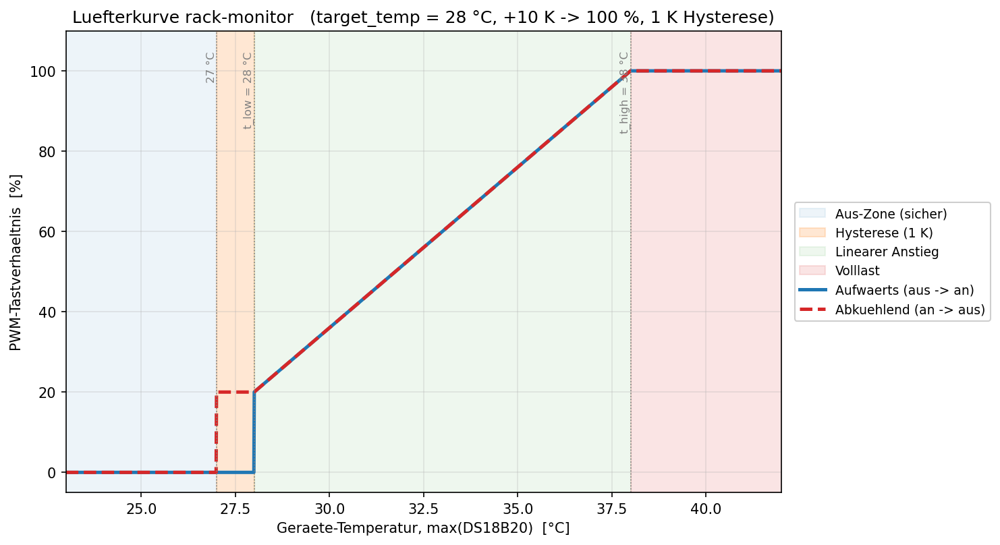

# Temperature Control

Automatic fan curve, evaluated every 20 s while `auto_mode` is on.

**Control variable:** `max(temp_zone1, temp_zone2)` — the warmer DS18B20 sets the speed. BMP280 is display-only. If both sensors return NaN, no action is taken.

**Curve** (`t_low` = `target_temp`, default 28 °C; `t_high` = `t_low + 10 °C`):

| Temperature | PWM |
|---|---|
| `< t_low − 1 °C` | 0 % |
| `t_low − 1 .. t_low` | hysteresis: 0 % if previously off, 20 % if previously on |
| `t_low .. t_high` | linear 20 → 100 % |
| `≥ t_high` | 100 % |

The 1 K hysteresis prevents on/off flutter at the switching threshold.

**HA entities:** `switch.luefter_automatik` (enable), `number.zieltemperatur` (`t_low`, 25–45 °C). With `auto_mode` off, the fan entities are controllable manually.

**Source:** `interval: 20s → lambda` in `rack-monitor.yaml`.

**Simulation:** `python3 fan_curve_plot.py [--yaml rack-monitor.yaml] [--target-temp 28]` — compiles the original lambda as C++ and sweeps a temperature range.

## Simulated temperature control

with the scripts provided in `esphome/temperature-simulator`, you can simulate the C++ code, which is embedded into the `rack-monitor.yaml`

