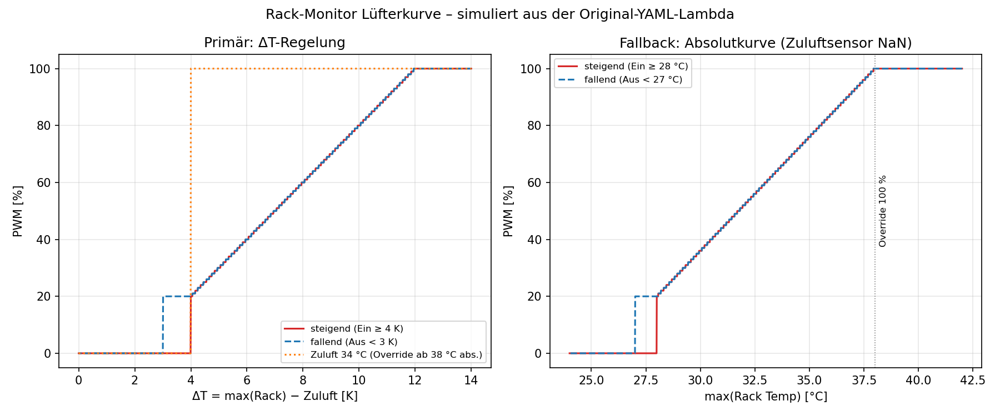

# Temperature Control

Automatic fan curve, evaluated every 15 s while `auto_mode` is on. The controller writes to the fan **entities** (not the raw PWM outputs), so Home Assistant always shows the true on/off state and speed.

**Control variable:** ΔT = `max(rack_temp_1, rack_temp_2) − intake_temp` — the warmer rack DS18B20 against the intake air reference. `fmaxf` is used, so one dead rack sensor does not block the control loop. If both rack sensors return NaN, no action is taken.

**Primary curve (delta-T mode):**

| ΔT | PWM |
|---|---|
| `< 3 K` | 0 % |
| `3 .. 4 K` | hysteresis: 0 % if previously off, 20 % if previously on |
| `4 .. 12 K` | linear 20 → 100 % |
| `≥ 12 K` | 100 % |

**Fallback (intake sensor NaN):** absolute curve on `max(rack_temp)` — on ≥ 28 °C, off < 27 °C (1 K hysteresis), linear 20 → 100 % across 28–38 °C.

**Override (safety net):** `max(rack_temp) ≥ 38 °C` forces 100 %, regardless of mode.

The 1 K hysteresis (in both modes) prevents on/off flutter at the switching threshold. All thresholds are hardcoded in the lambda.

**Manual override:** any manual fan interaction (HA card or web UI — on/off or speed) switches `auto_mode` off automatically. Changes made by the controller itself and the boot restore (first 10 s) are ignored. Re-enable via `switch.luefter_automatik`; the curve takes over on the next 15 s cycle.

**HA entities:** `switch.luefter_automatik` (enable), `sensor.rack_delta_t` (ΔT, for tuning), `fan.luefter_1` / `fan.luefter_2` (manual control while `auto_mode` is off).

**Source:** `interval: 15s → lambda` in `rack-monitor.yaml`.

## Simulated temperature control

With the scripts provided in `analysis/temperature-control-algo`, you can simulate the C++ code embedded in `rack-monitor.yaml`:

```
python3 fan_curve_plot.py [path/to/rack-monitor.yaml]
```

The script extracts the original lambda from the YAML, compiles it with g++ (fan entities and hysteresis state are stubbed in a small harness), and sweeps ΔT up and down as well as the absolute fallback range — the YAML remains the single source of truth. Each scenario runs in an isolated controller instance so the hysteresis branches are visible in the plot.

