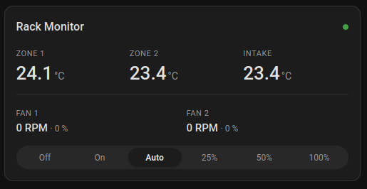

# Rack Monitor Card

[](https://github.com/dan1elw/ha-rack-monitor/releases/)
[](https://github.com/dan1elw/ha-rack-monitor/releases/)


[](https://github.com/hacs/integration)

Minimalist Lovelace card for the `ha-rack-monitor` project: three temperature
tiles, two fan rows (RPM · PWM %), an online badge with last update, and an
optional mode bar bound to the firmware's mode select.

[](https://my.home-assistant.io/redirect/hacs_repository/?owner=dan1elw&repository=ha-rack-monitor&category=Integration)

<div style="text-align: center;">
    
</div>

## Installation (HACS)

1. HACS → Custom repositories → add this repository as type **Dashboard**.
2. Install **Rack Monitor Card** and reload the browser.

The built `rack-monitor-card.js` is attached to every GitHub release by CI.

## Configuration

The card ships with a guided visual editor: every field is an entity picker
filtered to matching entities (temperature sensors, fans, select, connectivity).

YAML equivalent:

```yaml
type: custom:rack-monitor-card
title: Rack Monitor
zone1_entity: sensor.rack_monitor_zone_1_temperature
zone2_entity: sensor.rack_monitor_zone_2_temperature
intake_entity: sensor.rack_monitor_intake_temperature
fan1_entity: fan.rack_fan_1
fan1_rpm_entity: sensor.rack_fan_1_rpm
fan2_entity: fan.rack_fan_2
fan2_rpm_entity: sensor.rack_fan_2_rpm
mode_entity: select.rack_monitor_mode        # optional, shows the mode bar
status_entity: binary_sensor.rack_monitor_status  # optional
```

| Option | Required | Description |
| --- | --- | --- |
| `zone1_entity` … `intake_entity` | yes | Temperature sensors |
| `fan1_entity`, `fan2_entity` | no | Fan entities (PWM duty from `percentage`) |
| `fan1_rpm_entity`, `fan2_rpm_entity` | no | Tachometer sensors |
| `mode_entity` | no | Firmware mode select; hidden if omitted |
| `status_entity` | no | Connectivity sensor; falls back to sensor availability |
| `zone1_name` … `fan2_name` | no | Custom labels |

## Development

```bash
cd home-assistant
npm ci
npm run build   # → dist/rack-monitor-card.js
```
